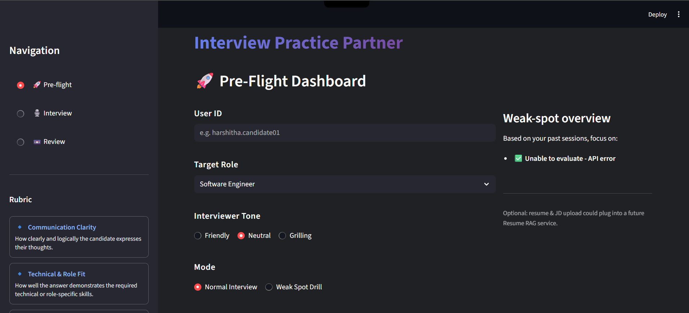
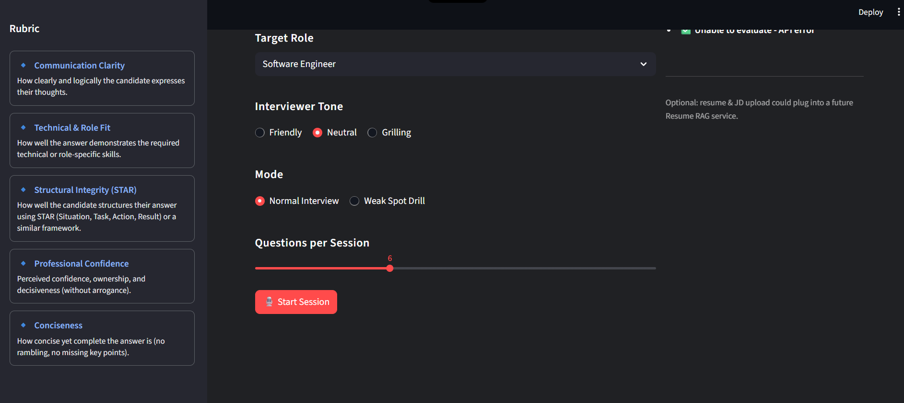
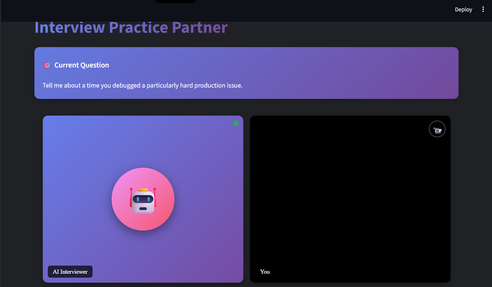
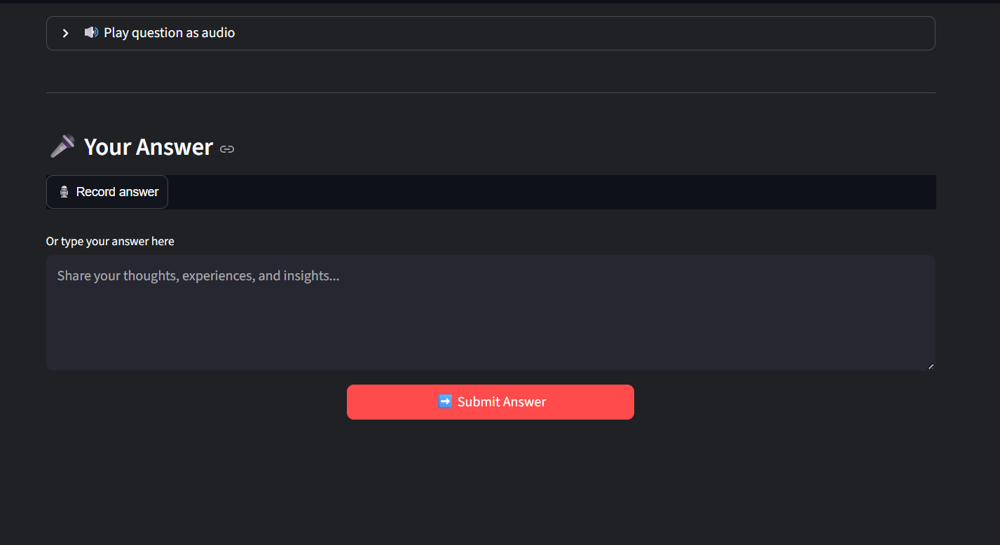
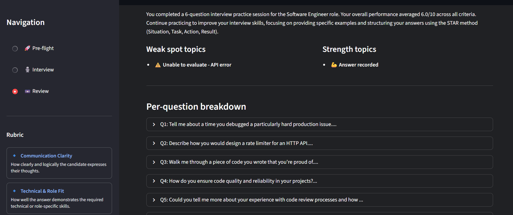

# Interview Practice Partner

📄 Complete Project Description
1. Overview

The AI Interview Practice Partner is an intelligent, multi-agent interview preparation platform designed to revolutionize how users practice interviews. It transforms traditional Q&A preparation into an engaging, adaptive, and personalized experience.

2. What It Does

Simulates realistic interview sessions

Generates intelligent, role-specific questions

Performs real-time evaluation of answers

Supports a voice-first experience

Delivers comprehensive feedback and improvement insights

3. Key Features

🎥 Immersive video interface for engaging interview simulations

🤖 Four-agent AI system

Orchestrator Agent

Interviewer Agent

Critic Agent

Memory Agent

🎯 5-dimensional evaluation system (Clarity, Technical Fit, STAR Structure, Brevity, Confidence)

🔄 Adaptive learning with dynamic question flow

🛡️ Built-in resilience through fallback logic and retries

4. Technology Stack

Frontend: Streamlit, HTML, CSS, JavaScript
Backend: Python, Gemini API
AI: Multi-agent architecture with orchestration

5. Use Cases

👨‍💼 Job seekers

🎓 Students & graduates

🔄 Career switchers

📈 Working professionals

6. How It Works

Pre-flight setup – 30 seconds

Interview session – 10–20 minutes

Review & feedback – 5 minutes

7. What Makes It Unique

Production-ready architecture

Intelligent multi-agent integration

Resilience-first backend design

User-centric, interactive interface

8. Technical Highlights

Detailed multi-agent orchestration diagram

Robust fallback strategies

Clear data flow design

System performance metrics

9. Future Vision

Mobile applications

Multi-language support

Advanced AI analysis

VR-based interview simulations

10. Getting Started

Quick setup commands

Link to detailed setup guide

11. Project Structure

Complete directory tree

Description of all major files and modules

12. Success Stories

User testimonials

Measured improvements in interview readiness

🎯 Key Highlights

✅ Comprehensive: Covers everything from overview to technical depth

✅ User-Friendly: Clear for both technical & non-technical readers

✅ Professional: Ideal for portfolios, presentations, and documentation

✅ Complete: Includes architecture, features, use cases, and roadmap

✅ Visual: Supports diagrams, structure trees, and code snippets

## 📸 Overview

### Preflight view 1


### Preflight view 2


### Interview 1


### Interview 2


### Review 1



## 📊 User Flow Diagram


## 🤖 Agent Orchestration Diagram


## Prerequisites

- Python 3.10 - 3.12 (Python 3.14 is currently unsupported due to dependency issues)
- [Google Gemini API Key](https://aistudio.google.com/app/apikey)

## Setup

1.  **Clone the repository** (if you haven't already):
    ```bash
    git clone <repository-url>
    cd interview-practice-partner
    ```

2.  **Create a virtual environment**:
    ```bash
    python -m venv venv
    ```

3.  **Activate the virtual environment**:
    - Windows:
        ```powershell
        .\venv\Scripts\activate
        ```
    - macOS/Linux:
        ```bash
        source venv/bin/activate
        ```

4.  **Install dependencies**:
    ```bash
    pip install -r requirements.txt
    ```

5.  **Configure Environment Variables**:
    - Create a `.env` file in the root directory.
    - Add your Google API key:
        ```
        GOOGLE_API_KEY=your_api_key_here
        ```

## Running the Application

To start the application, run:

```bash
streamlit run app.py
```

The application will open in your default web browser at `http://localhost:8501`.


